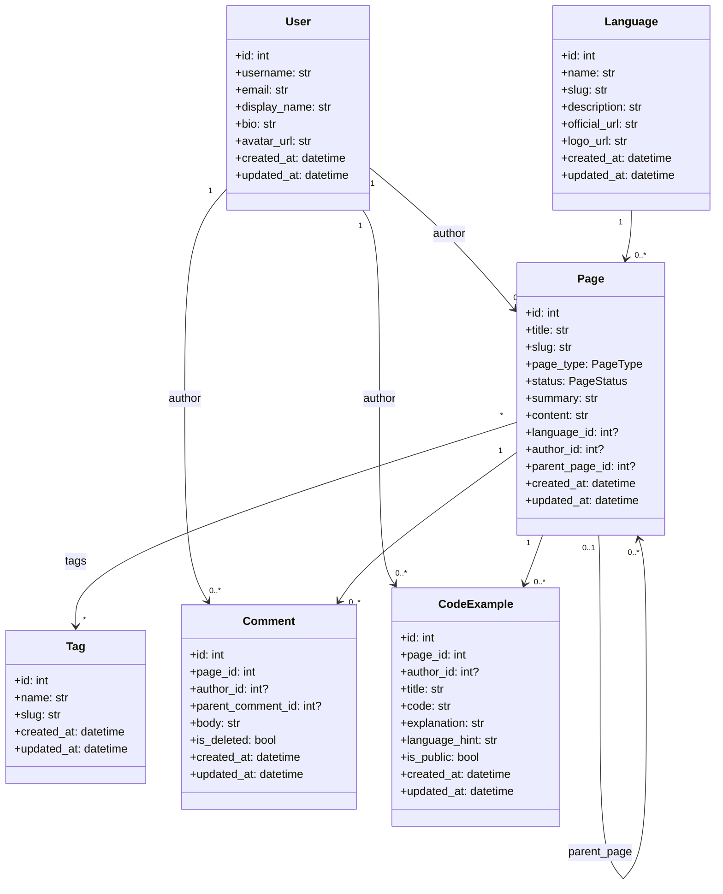

# Diagrama de classes

```mermaid
classDiagram
    class User {
      +id: int
      +username: str
      +email: str
      +display_name: str
      +bio: str
      +avatar_url: str
      +created_at: datetime
      +updated_at: datetime
    }

    class Language {
      +id: int
      +name: str
      +slug: str
      +description: str
      +official_url: str
      +logo_url: str
      +created_at: datetime
      +updated_at: datetime
    }

    class Tag {
      +id: int
      +name: str
      +slug: str
      +created_at: datetime
      +updated_at: datetime
    }

    class Page {
      +id: int
      +title: str
      +slug: str
      +page_type: PageType
      +status: PageStatus
      +summary: str
      +content: str
      +language_id: int?
      +author_id: int?
      +parent_page_id: int?
      +created_at: datetime
      +updated_at: datetime
    }

    class Comment {
      +id: int
      +page_id: int
      +author_id: int?
      +parent_comment_id: int?
      +body: str
      +is_deleted: bool
      +created_at: datetime
      +updated_at: datetime
    }

    class CodeExample {
      +id: int
      +page_id: int
      +author_id: int?
      +title: str
      +code: str
      +explanation: str
      +language_hint: str
      +is_public: bool
      +created_at: datetime
      +updated_at: datetime
    }

    User "1" --> "0..*" Page : author
    User "1" --> "0..*" Comment : author
    User "1" --> "0..*" CodeExample : author
    Language "1" --> "0..*" Page
    Page "1" --> "0..*" Comment
    Page "1" --> "0..*" CodeExample
    Page "0..1" --> "0..*" Page : parent_page
    Page "*" --> "*" Tag : tags
```
