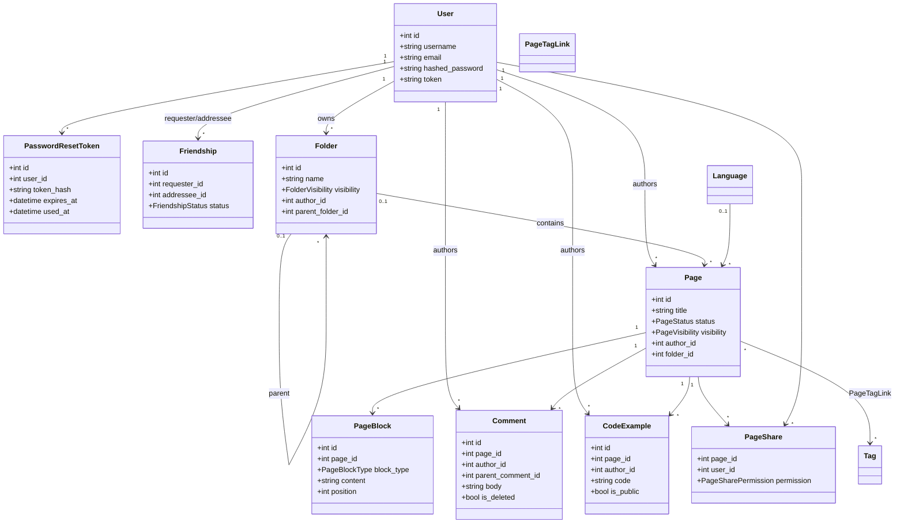

# Diagrama de classes

As regras de acesso não ficam espalhadas nas classes: são centralizadas em `app/permissions.py`, que combina autoria, amizade, compartilhamento específico e privacidade hierárquica das pastas.
