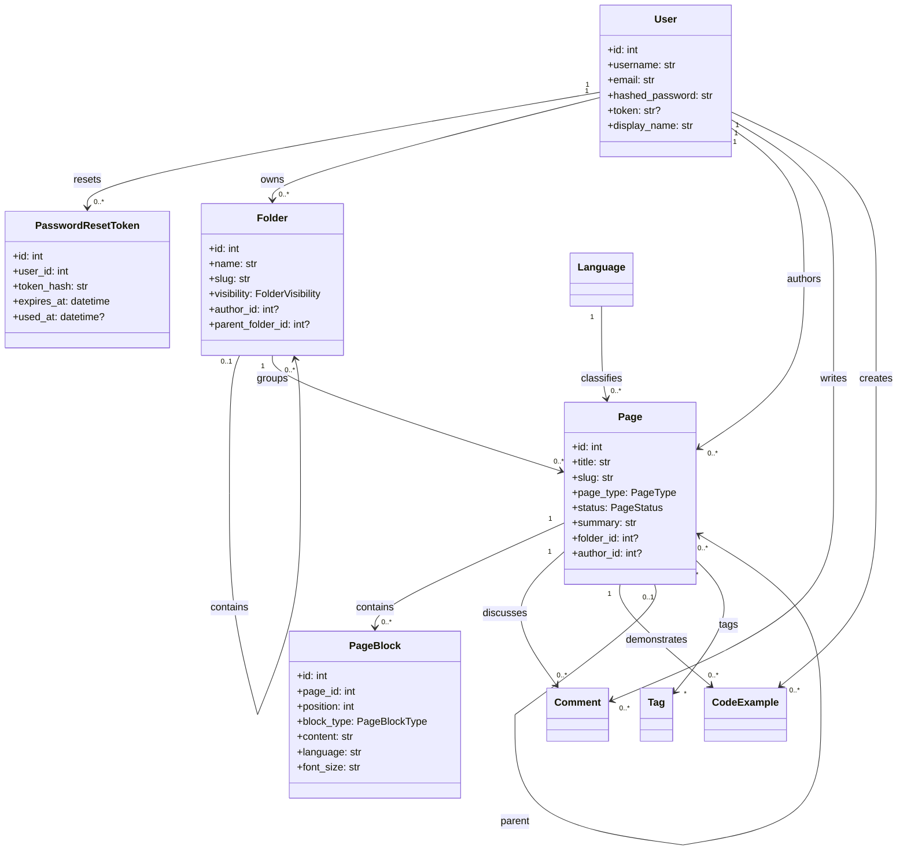

# Diagrama de classes

```mermaid
classDiagram
    class User {
      +id: int
      +username: str
      +email: str
      +hashed_password: str
      +token: str?
      +display_name: str
    }
    class PasswordResetToken {
      +id: int
      +user_id: int
      +token_hash: str
      +expires_at: datetime
      +used_at: datetime?
    }
    class Folder {
      +id: int
      +name: str
      +slug: str
      +visibility: FolderVisibility
      +author_id: int?
      +parent_folder_id: int?
    }
    class Page {
      +id: int
      +title: str
      +slug: str
      +page_type: PageType
      +status: PageStatus
      +summary: str
      +folder_id: int?
      +author_id: int?
    }
    class PageBlock {
      +id: int
      +page_id: int
      +position: int
      +block_type: PageBlockType
      +content: str
      +language: str
      +font_size: str
    }
    class Language
    class Tag
    class Comment
    class CodeExample

    User "1" --> "0..*" PasswordResetToken : resets
    User "1" --> "0..*" Folder : owns
    User "1" --> "0..*" Page : authors
    User "1" --> "0..*" Comment : writes
    User "1" --> "0..*" CodeExample : creates
    Folder "0..1" --> "0..*" Folder : contains
    Folder "1" --> "0..*" Page : groups
    Language "1" --> "0..*" Page : classifies
    Page "1" --> "0..*" PageBlock : contains
    Page "1" --> "0..*" Comment : discusses
    Page "1" --> "0..*" CodeExample : demonstrates
    Page "0..1" --> "0..*" Page : parent
    Page "*" --> "*" Tag : tags
```

> O PR #35 expande o modelo de comentários para blocos e atividades. Atualize este diagrama novamente depois do merge.
