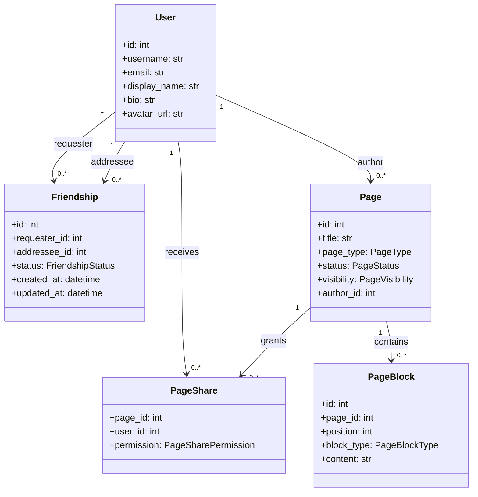

# Diagrama de classes

## Regras de acesso

- `PRIVATE`: somente o autor.
- `FRIENDS`: autor e amizades aceitas.
- `PUBLIC`: qualquer usuário autenticado.
- `CUSTOM`: autor e usuários presentes em `PageShare`.
- `VIEW`: leitura da página.
- `EDIT`: leitura e edição de metadados/conteúdo; somente o autor controla o compartilhamento e exclui a página.
